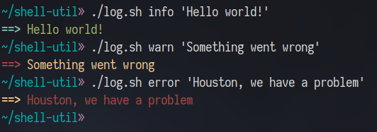

# shell-util

Collection of useful shell scripts.

Written in POSIX sh for maximum portability.

## Scripts

### log.sh



This script prints a coloured log entry, with different error levels (info, warning, and error).

The colours are different depending on the error level.

#### Arguments

| Argument | Description                                       | Example                                      |
|----------|---------------------------------------------------|----------------------------------------------|
| `$1`     | Log type - enumeration of `info`, `warn`, `error` | `./log.sh info 'Hello world!'`               |
| `$2`     | Log contents - freetext field                     | `./log.sh info 'This is my logging string.'` |

#### Usage

```shell
$ ./log.sh info 'Hello world!'
$ ./log.sh warn 'Something went wrong'
$ ./log.sh error 'Houston, we have a problem'
```

### get_arch.sh

This script accounts for edge conditions in detecting CPU architecure across OSes.

The output string is in GOARCH format.

No arguments are read.

#### Usage

```shell
$ ./get_arch.sh
```
